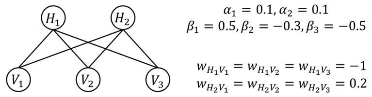
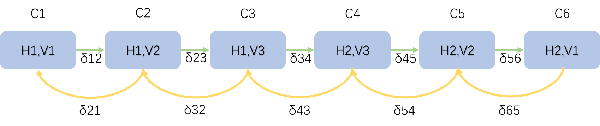
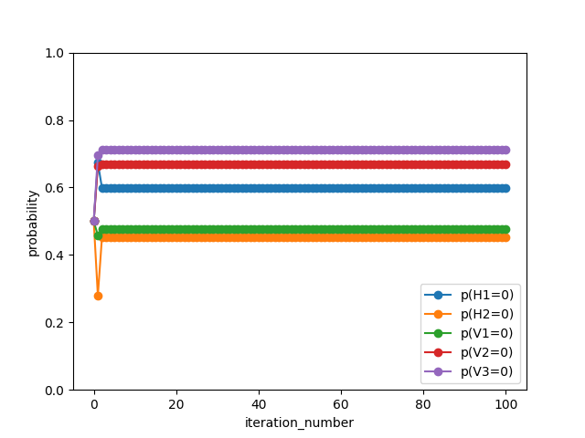

# Readme of belief propagation
This is a simple implementation of belief propagation algorithm for inference in graphical models.   
The code is written in python.  
author: [June Drinleng](zhu-jl24@mails.tsinghua.edu.cn)
date: 2024-11-22

## 1. Introduction
The code is trying to solve the inference problem in restrict boltzmann machine. It contains 5 nodes---3 nodes observed and 2 nodes hidden. 

all the weights(including node weight and edge weight) are given in the image above.

and we are required to calculate the distribution of each node.

## 2 construction of clique tree

we select the order in the following :

the $\delta$ is the message we pass between to clique. For example, the $\delta_{12}$ is the message passed from clique 1 (C1) to clique 2 (C2).

Then what I am doing is trying to write down the fomula of $\delta$:
$$
\delta_{12}=\frac{1}{\mu_{12}}*[\sum_{V_1}\psi(C_1)]\\
=\frac{1}{\mu_{12}}*[\sum_{V_1} exp(\alpha_1 H_1+\beta_1V_1+W_{11}H_1V_1)]\\
=\frac{1}{\mu_{12}}*[p(V_1=1)exp(\alpha_1 H_1+\beta_1+W_{11}H_1)+p(V_1=0)exp(\alpha_1 H_1)]
$$
the $\psi$ is Potential Function which can be easily written down using the knowledge of markov random field.

for each $H_1$ we can get different $\delta_{12}$  

the same to $\delta_{23}$:  
$$
\delta_{23}=\frac{1}{\mu_{23}}*[\sum_{V_2}\psi(C_2)*\delta_{12}]\\
=\frac{1}{\mu_{23}}*[\delta_{12}*\sum_{V_2} exp(\alpha_1 H_1+\beta_2V_2+W_{12}H_1V_2)]\\
=\frac{1}{\mu_{23}}*(\delta_{12}*[p(V_2=1)exp(\alpha_1 H_1+\beta_2+W_{11}H_1)+p(V_2=0)exp(\alpha_1 H_1)])
$$
and in $\delta_{23}$ we need to calculate different $H1$:  
$$
\delta_{45}=\frac{1}{\mu_{45}}*[\sum_{V_3}\delta_{34}\psi(C_4)]\\
=\frac{1}{\mu_{45}}*[\sum_{V_3}\delta_{34}*exp(\alpha_2H_2+\beta_3V_3+w_{23}H_2V_3)]\\
=\frac{1}{\mu_{45}}*[\delta_{34}(V_3=1)*P(V_3=1)*exp(\alpha_2H_2+\beta_3+w_{23}H_2)+\delta_{34}(V_3=0)*P(V_3=0)*exp(\alpha_2H_2)]
$$
it can be calculated when $H_2=1 \ or \ 0$  , and the $\delta_{56},\delta_{65},\delta_{54}$ is the same:
$$
\delta_{56}=\frac{1}{\mu_{56}}*[\sum_{V_2}\delta_{45}\psi(C_5)]\\
=\frac{1}{\mu_{56}}*[P(V_2=1)*\delta_{45}exp(\alpha_2H_2+\beta_2+w_{22}H_2)+P(V_2=0)*\delta_{45}exp(\alpha_2H_2)]
$$

$$
\delta_{65}
=\frac{1}{\mu_{65}}*[P(V_1=1)*\delta_{56}exp(\alpha_2H_2+\beta_1+w_{21}H_2)+P(V_1=0)*\delta_{56}exp(\alpha_2H_2)]
$$

$$
\delta_{54}=\frac{1}{\mu_{54}}*[\sum_{V_2}\delta_{65}\psi(C_5)]\\
=\frac{1}{\mu_{54}}*[P(V_2=1)*\delta_{65}*exp(\alpha_2H_2+\beta_2+w_{22}H_2)+P(V_2=0)*\delta_{65}*exp(\alpha_2H_2)]
$$

and in $\delta_{43}$ we need to sum $H_2$, so the different value when $H_2$ is different  in the above message can be used:
$$
\delta_{32}=\frac{1}{\mu_{32}}*[\sum_{V_3}\delta_{43}*exp(\alpha_1H_1+beta_3V_3+w_{13}H_1V_3)]\\
=\frac{1}{\mu_{32}}*[P(V_3=1)*\delta_{43}(V_3=1)*exp(\alpha_1H_1+\beta_3+w_{13}H_1)+P(V_3=0)*\delta_{43}(V_3=0)*exp(\alpha_1H_1)]
$$
 it can also calculate 2 values when $H_1=1$ and $H_1=0$ and that will be used in $\delta_{21}$  
$$
\delta_{21}
=\frac{1}{\mu_{21}}*[P(V_2=1)*\delta_{32}(V_2=1)*exp(\alpha_1H_1+\beta_2+w_{12}H_1)+P(V_2=0)*\delta_{32}(V_2=0)*exp(\alpha_1H_1)]
$$
 after passing all the message and use the update $\psi$ to updata the belief:
$$
P(H_1=1)=\frac{1}{\mu_{21}}*[\sum_{V_1}\delta_{21}(H_1=1)*exp(\alpha_1+\beta_1V_1+w_{11}V_1)]\\
P(V_1=1)=\frac{1}{\mu_{21}}*[\sum_{H_1}\delta_{21}*exp(\alpha_1H_1+\beta_1+w_{11}H_1)]\\
P(V_2=1)=\frac{1}{\mu_{32}}*[\sum_{H_1}\delta_{32}*exp(\alpha_1H_1+\beta_2+w_{12}H_1)]\\
P(V_3=1)=\frac{1}{\mu_{43}}*[\sum_{H_1}\delta_{43}*exp(\alpha_1H_1+\beta_3+w_{13}H_1)]\\
P(H_2=1)=\frac{1}{\mu_{54}}*[\sum_{V_3}\delta_{54}*(H_2=1)exp(\alpha_2+\beta_3+w_{23}V_3)]
$$
and update all the history message $ \mu$ to complete 1 iteration

using the above idea to construct the code we can get the following result:

and we can get the final distribution:
$$
P(H_1=0)=0.598687660112452\\

P(H_2=0)=0.45263212086037613\\

P(V_1=0)=0.47582955028950635\\

P(V_2=0)=0.668906346885627\\

P(V_3=0)=0.7116154398820861
$$
We found that even if we iterate more times, it is difficult to achieve a final value that is within $10^{-6} $of the previous iteration value.

the code is in the [clique_tree.py](./clique_tree.py)
