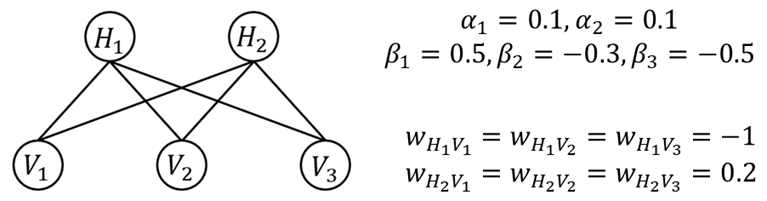
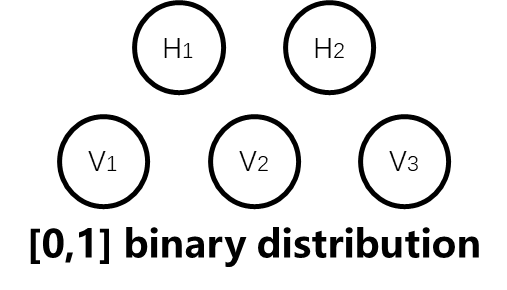
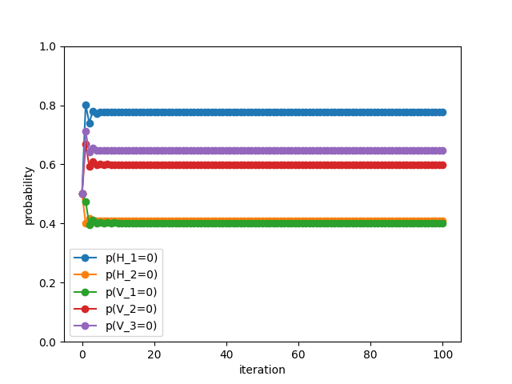

# Readme of mean field algorithm
This is a simple implementation of mean field algorithm for inference in graphical models.
The code is written in python.
author: June Drinleng date: 2024-11-22

## 1. Introduction
he code is trying to solve the inference problem in restrict boltzmann machine. It contains 5 nodes---3 nodes observed and 2 nodes hidden.

all the weights(including node weight and edge weight) are given in the image above.

and we are required to calculate the distribution of each node.

## 2. construct the algorithm

we use mean field assumption to simplify the model into 5 node with Binomial Distribution and without the node-node interaction as below:

in the original network, we can write the formula as following:( haven't done normalization)
$$
\tilde p(H,V)=\sum_{i=1}^{2}\alpha_iH_i+\sum_{i=1}^{3}\beta_iV_i+\sum_{i=1}^{2}\sum_{j=1}^{3}w_{ij}H_iV_j
$$
and we use a simplify function Q to approximate， and here is the graph above, which means all the nodes are independent:
$$
q(H,V)=\prod_{i=1}^2q_{H_i}H_i*\prod_{i=1}^3q_{V_i}V_i
$$
and we directly use the Q function to replace the original probability:
$$
q_{H_i}(H_i=1)=p_{H_i}\ for\ i=(1,2)\\
q_{V_i}(V_i=1)=p_{V_i}\ for\ i=(1,2,3)
$$
now we need to figure out how to distribute updates to each node:

for $H_1$:
$$
\mathbb{E}_{q(H_2,V_1,V_2,V_3)}[log  \ \tilde p(H,V)]=\alpha_1 H_1+\sum_{j=1}^{3}w_{H_1V_j} pV_j H_1
$$
so:  
$$
q_{H_1}(H_1=0)\propto exp(0)=1 \\
q_{H_1}(H_1=1)\propto exp(\alpha_1+\sum_{j=1}^{3}w_{H_1V_j} pV_j ) \\
$$
than we can get the $p_{H_1}^{(t+1)}$:  
$$
p_{(H_1=1)}^{(t+1)}=\frac{exp(\alpha_1+\sum_{j=1}^{3}w_{H_1V_j} pV_j )}{1+exp(\alpha_1+\sum_{j=1}^{3}w_{H_1V_j} pV_j )}
$$
Similarly for $H_2$ we can also write the iterative formula:
$$
p_{(H_2=1)}^{(t+1)}=\frac{exp(\alpha_2+\sum_{j=1}^{3}w_{H_2V_j} pV_j )}{1+exp(\alpha_2+\sum_{j=1}^{3}w_{H_2V_j} pV_j )}\\
p_{(V_1=1)}^{(t+1)}=\frac{exp(\beta_1+\sum_{i=1}^{2}w_{H_iV_1} pH_i )}{1+exp(\beta_1+\sum_{i=1}^{2}w_{H_iV_1} pV_1 )}\\
p_{(V_2=1)}^{(t+1)}=\frac{exp(\beta_2+\sum_{i=1}^{2}w_{H_iV_2} pH_i )}{1+exp(\beta_2+\sum_{i=1}^{2}w_{H_iV_2} pV_2 )}\\
p_{(V_3=1)}^{(t+1)}=\frac{exp(\beta_3+\sum_{i=1}^{2}w_{H_iV_3} pH_i )}{1+exp(\beta_3+\sum_{i=1}^{2}w_{H_iV_3} pV_3)}\\
$$
The above iteration formula can be used to construct a loop to achieve repeated iterations  

For the convenience of comparison with the above, we also convert it into the probability of H or V equal to 0 to draw the graph and give the results    

$$
P(H_1=0)= 0.7775418828674618\\
P(H_2=0)= 0.40847342994392866\\
P(V_1=0)= 0.40231050310554106\\
P(V_2=0)= 0.59968500551148\\
P(V_3=0)= 0.6466058264214332\\
$$
We found that it only takes 11 iterations to reach the 10^-6 convergence result that the previous cluster graph could not achieve.  
the code is in the [mean_field.py](./mean_field.py)